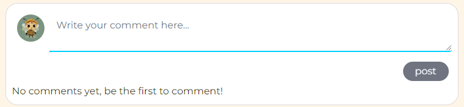

# Wander Hub Frontend

Wander Hub is a social media platform for travelers to share their trips, explore new places, and connect with other travel lovers. Users can easily create posts with stories and photos, like and comment on others posts, and save their favorites for later. The platform features a simple interface with easy login, post management, and search options, working seamlessly on all devices.

The frontend, built with React, is designed to be clean, responsive, and user-friendly. The project is developed as a Portfolio Project 5 (Advanced Front End / React) for the Code Institute's Full Stack Software Development Course. This React project focuses on building a responsive and interactive frontend, allowing users to easily perform CRUD functionality like adding, editing, and deleting posts, while connecting to the backend API to handle data management.

   - Link to the live website: [Wander Hub Frontend](https://wanderhub-frontend-56da935583f2.herokuapp.com/)
   - Link to the live API: [Wander Hub API](https://wanderhub-api-backend-8af792a9ebf9.herokuapp.com/)
   - Link to the Backend Repository: [wanderhub-backend](https://github.com/bhagyashriyogeshpatil/wanderhub_api_backend)

---
# Table of Contents
- [Introduction](#introduction)
- [User Experience Design](#user-experience-design)
  - [Strategy](#strategy)
  - [Site Goals](#site-goals)
  - [Scope](#scope)
  - [Structure](#structure)
  - [Skeleton](#skeleton)
  - [Surface](#surface)
- [Agile Development Process](#agile-development-process)
    - [Agile Planning](#agile-planning)
      - [User Stories and Management](#user-stories-and-management)
      - [Milestones Overview](#milestones-overview)
- [The Structure Plane](#the-structure-plane)
  - [Current Features](#current-features)
- [Testing](#testing)
---

## Introduction

Wander Hub is a social media platform for travelers to share their adventures, discover new places, and connect with other travel lovers. The frontend is built using React, providing a fast, responsive, and interactive user experience.

Users can quickly sign up and log in to access their dashboard. They can create, view, edit, and delete their travel posts, as well as like and comment on other users posts. Users can follow others for updates and react to comments to enhance interaction.

They can also save favorite posts for later and update their profile information, such as their bio and avatar. The platform has search and filter options, allowing everyone to find content by title, username, region, or place. It is designed to work well on all devices, ensuring a smooth experience on desktops, tablets, and smartphones. Wander Hub makes it easy for travelers to connect and share their experiences in a user-friendly way.

*[Back to Content](#table-of-contents)* 

## User Experience Design

### Strategy
Wander Hub’s design focuses on creating a smooth, easy-to-use platform for travellers to share trips and discover new places. Using Agile methods, the project is developed in small steps. The goal is to meet user needs, make the platform mobile-friendly, and ensure a great experience when creating posts, exploring content, and interacting with others.

*[Back to Content](#table-of-contents)* 

### Site Goals
Wander Hub aims to bring together travellers who want to share their adventures and discover new destinations. Whether it’s a quick weekend getaway or an international trip, users can post travel stories, share photos, and write about their experiences.

**Key Goals:**
- **Easy User Authentication:** Simplified sign-up and login with just a username and password, giving users access to a personalized dashboard.
- **CRUD Functionality for Travel Posts:** Registered users can create, view, edit, and delete their posts, giving them control over their content.
- **Engagement and Interaction:** Users can like and comment on posts, helping to build a community. They can also follow others to see their updates and manage their comments by creating, editing, or deleting them.
- **Comment Reactions:**  Users can react to comments (e.g., like or appreciate), enhancing interaction and feedback within the community.
- **Saved Posts for Future Reference:** Users can save favorite travel stories and destinations for easy access later.
- **Profile Management:** Logged-in users can update their profile details (bio, username, password, avatar), which are visible on all pages.
- **Advanced Search and Filter Options:** All users including those not logged in can explore content using search and filter features by title, username, region, or place.
- **Responsive Design:** The platform is optimized for all devices, ensuring a consistent user experience across desktops, tablets, and smartphones.

*[Back to Content](#table-of-contents)* 

### Scope
The design of Wander Hub is centred on key features and accessibility. The front-end is responsive and built with React, while the back-end uses Django Rest Framework. Users can create, manage, and interact with travel posts, while features like authentication, liking, commenting, and following others enhance engagement. The interface is designed to be simple and easy to use, with continuous adjustments based on testing and feedback to improve the overall experience.

*[Back to Content](#table-of-contents)* 

### Structure
Wander Hub’s development is organized with clear milestones and user stories:
- **Milestones:** These cover major tasks, like setting up the backend, building the frontend, and implementing features such as login and post management, helping the project stay on track.
- **User Stories:** Tasks are broken down into smaller steps, focusing on features like creating and editing posts, managing profiles, and enabling users to comment and like posts. Priorities are set to focus on the most important features first.

This approach ensures the platform is built with the user’s needs in mind.

*[Back to Content](#table-of-contents)* 

### Skeleton
The design is planned using wireframes and ERD that show how the database is organized:
- **Wireframes:** Visual sketches of important pages, like the homepage and user profiles, were created to ensure the layout is clear and easy to navigate.
- **Entity-Relationship Diagram (ERD):** These diagram map out how data is structured, showing how users, posts, comments, and followers relate to each other. This ensures everything works smoothly behind the scenes.

*[Back to Content](#table-of-contents)* 

### Surface
Wander Hub features a clean and modern design that is both attractive and easy to use. It uses simple layouts, clear fonts, and consistent icons to make navigation straightforward. The responsive design ensures the platform looks great and works well on any device, whether it’s a desktop, tablet, or smartphone.

*[Back to Content](#table-of-contents)* 

## Agile Development Process

### Agile Planning

For this project, I implemented an Agile methodology, organizing the entire process using a GitHub project board. This approach allowed me to manage the development from the initial planning stages to the final deployment. The project was divided into 6 milestones, each representing a key phase of the development process, ensuring that progress was systematic and aligned with the project’s goals.

You can view the entire Project Board, including all user stories and progress updates, here: <a href="https://github.com/users/bhagyashriyogeshpatil/projects/4" target="_blank">Github Project board</a>

User Story Template

Kanban Board

#### **User Stories and Management:**

- **Acceptance Criteria:** 
Each user story was created with clear acceptance criteria to ensure that everyone understands what needs to be done. This approach guarantees that every task meets the required standards before it can be marked as complete.

- **MoSCoW Prioritization:** 
To effectively manage priorities, features were categorized using the MoSCoW method: 'Must have,' 'Should have,' and 'Could have.' This prioritization ensured that the essential features for the Minimum Viable Product (MVP) were developed first, while secondary features could be added if there was enough time.

- **User Stories Overview:** 
All user stories include:
  - **Acceptance Criteria:** Clearly defined requirements for completion.
  - **Labels for Prioritization:** Each feature is labeled as 'Must have,' 'Should have,' or 'Could have' to help prioritize development tasks.

- **Additional Labels:** 
I have also created two additional labels to show which tasks needed backend work and which needed frontend work:    
    - **API-backend** - for tasks related to backend API implementation
    - **React-frontend** - for tasks related to the frontend React app
Each user story was thoroughly checked to ensure it met the requirements before being closed.

*[Back to Content](#table-of-contents)* 

#### **Milestones Overview:** 
The development of Wander Hub is organized into six key milestones, each focusing on specific aspects of the project. Below is a detailed overview of each milestone along with the associated user story numbers:

**1. Project Setup and Deployment**
- This milestone focuses on setting up the project infrastructure and deploying the application.
  - User Story 1: Set up API Project
  - User Story 2: Set up Frontend Project
  - User Story 40: Deploy Project to Heroku
  - User Story 41: Create README.md File

**2. Basic UI/UX Elements**
- In this phase, I implemented essential user interface and experience elements to enhance usability.
  - User Story 3: Display Favicon in Browser Tab
  - User Story 4: Consistent Navigation Bar Across All Pages
  - User Story 5: Seamless Page Navigation

**3. User Authentication and Profile Management**
- This milestone is dedicated to user authentication and managing user profiles.
  - User Story 6: User Sign-Up
  - User Story 7: User Sign-In
  - User Story 8: Indicate Logged-In Status
  - User Story 9: Maintain Logged-In Status with Token Refresh
  - User Story 10: Conditional Rendering for Authentication Options
  - User Story 11: Display User Avatar
  - User Story 31: View Other Users' Profiles
  - User Story 34: Edit Profile Details
  - User Story 35: Update Username and Password
  - User Story 37: Use Default Profile Image

**4. Post and Comment Features**
- This phase focuses on the core functionality for users to create and manage their posts and comments.
  - User Story 12: Create and Share Posts
  - User Story 13: View Post Details
  - User Story 14: Edit Own Posts
  - User Story 15: Delete My Posts
  - User Story 16: View Recent Posts
  - User Story 17: Search for Posts
  - User Story 20: Add Comments to Posts
  - User Story 21: Read Comments on Posts
  - User Story 22: Edit Own Comment
  - User Story 23: Delete Own Comment

**5. Interaction and Social Features**
- This milestone enhances social interactions within the platform, allowing users to connect and engage with each other.
  - User Story 18: Like Posts
  - User Story 19: Unlike Posts
  - User Story 24: Follow Users
  - User Story 25: Unfollow Users
  - User Story 26: Save Posts
  - User Story 27: Remove Saved Posts
  - User Story 28: Comment Reactions on Post
  - User Story 29: View Feed from Followed Users
  - User Story 30: View Liked Posts

**6. Extended User Features**
- The final milestone introduces advanced features to enhance the overall user experience.
  - User Story 32: View User Statistics
  - User Story 33: View All Posts by a Specific User
  - User Story 36: View Most Followed Profiles
  - User Story 38: Infinite Scroll for Posts
  - User Story 39: Infinite Scroll for Comments

*[Back to Content](#table-of-contents)* 

## The Structure Plane

### Current Features
All features have been implemented with user stories in mind.

*[Back to Content](#table-of-contents)* 

#### **Favicon**
- *As a user*, I want a favicon icon to be shown in the browser tab for the website so that I can easily identify and navigate to the site when I have multiple tabs open. (User Story#3)

- The favicon is shown in the browser tab, helping users easily identify and navigate back to the website when multiple tabs are open.
- The favicon has been selected with the project theme in mind, representing the WanderHub concept. It features a starting point and a destination connected by a route.

*[Back to Content](#table-of-contents)* 

#### **Navigation Menu**
- *As a user*, I want to view a navigation bar on every page so that I can easily navigate between pages without having to search for navigation options. (User Story#4)
- *As a user*, I want to navigate through pages quickly without page refreshes so that I can view content seamlessly. (User Story#5)
- *As a user*, I want to easily tell if I am logged in so that I know whether I need to log in or can access logged-in features. (User Story#8)

- Navbar for Desktop (Unauthorized Users)

- Navbar for Desktop (Authorized Users)

- Navbar for Mobile (Unauthorized Users)

- Navbar for Mobile (Authorized Users)

- The navigation menu is designed to make it easy for users to move around the website. The navigation bar looks the same on every page for a uniform experience. On smaller screens, it changes to a hamburger menu for easy access.
- When a user is logged in, their profile avatar and username are displayed in the navigation bar. This feature adds a personalized touch to each visit, helping users feel more connected to their account.
- The main purpose of the navigation menu is to help users move easily around the website. They can quickly reach different pages without getting lost.
- The shown username and profile picture let users know they are logged in, giving them confidence about their account status.
- The navigation options change based on whether the user is logged in or not. This keeps the menu simple and easy to use without making it too complicated.
- The currently active page is clearly marked, so users know where they are.
- The following options are available based on the user's logged-in status:
  - Home - for all users
  - Sign Up - for unauthorized users
  - Sign In - for unauthorized users
  - Sign Out - for authorized users
  - Add Post - for authorized users
  - Feed - for authorized users
  - Liked - for authorized users
  - Saved Posts - for authorized users
  - Profile Avatar - for authorized users
  - Username - for authorized users

*[Back to Content](#table-of-contents)* 

#### **Sign in / Sign up / Sign out**

- The Sign Up, Sign In, and Sign Out features allow users to register, log in, and log out of the website. These features enable users to explore and interact with all content, including posts, comments, and user profiles, while having full control over their own content.
- *As a user*, I want create a new account so that I can access all features available to signed-up users. (User Story#6)
- Sign Up page for Desktop :

- Sign Up page for Mobile :

- The Sign Up feature lets new users create an account to access all the features of the website. Registered users can log in to use personalized services.
- The sign-up page works on both large and small screens, adapting to mobile, tablet, and desktop devices.
- New users can create an account by filling out the form with their name, email, and password.
- If the user is already registered, they can use a convenient link to go to the login page.

- *As a user*, I want to sign in to the app so that I can access functionality available only to logged-in users. (User Story#7)
- Sign In page for Desktop :

- Sign In page for Mobile :

- The Sign In feature lets registered users log in to access all the features available to authorized users. 
- Registered users can sign in with their email and password.
- If the user isn't registered, a Sign Up link is available on the sign-in page.
- Clear feedback is given when sign-in details are incorrect.

- *As a user*, I want to maintain my logged-in status until I choose to log out so that my user experience remains uninterrupted. (User Story#9)

- Users can sign out whenever they choose, ending their session and ensuring their account remains secure.
- The goal of this feature is to allow users to perform CRUD functionality on their content and access other features of the website as long as they choose not to sign out. This gives users complete control, making it easy for them to navigate pages without being signed out automatically.
- When users register or sign in, they can create travel posts (with CRUD functionality), add comments to those posts (with CRUD functionality), react to comments, like or dislike posts from other users, save their favorite posts, follow or unfollow other users, and access their own content and profile (where they can also use CRUD functionality). This lets them explore all the website features made for them.

*[Back to Content](#table-of-contents)*

#### **Home Page (Posts Page)**
- *As a user*, I want to see a list of the most recent posts so that I can browse and stay updated with the latest content. (User Story#16)
- As a user, I can keep scrolling through posts without clicking "next page" so that I can easily access more content. (User Story#38)
- *As a user*, I want to view all the posts by a specific user so that I can catch up on their latest content or decide whether to follow them. (User Story#33)
- *As a user*, I want to navigate through pages quickly without page refreshes so that I can view content seamlessly. (User Story#5)
- Home Page for Desktop (Unauthorized Users):

- Home Page for Desktop (Authorized Users)

- Home Page for Mobile (Unauthorized/authorized Users):

- The home page is open to all users, whether they are logged in or not, when they enter the website. 
- It shows a list of all travel posts, with the newest ones at the top. This way, users can easily see the latest updates.
- Each post includes an image, title, content, place, region, the date it was created or updated, and the name and avatar of the person who posted it.
Below each post, there are icons for liking, commenting, and saving posts.
- A search bar is available for users to find specific posts easily, and a sidebar showcases popular profiles to follow.
- Users can view all posts from a specific user by clicking on their profile avatar in individual posts or from the sidebar. This will take user to that person’s profile, where all their posts are listed, starting with the most recent ones.
- The home page uses infinite scrolling, so users can keep scrolling through posts without having to click through pages.
- The website allows users to move between different pages easily, so they don't have to wait for the page to reload every time they click on something. This makes the whole experience smooth and enjoyable.

*[Back to Content](#table-of-contents)*

#### **Post Detail**
- *As a user*, I want to click on a post to see its details so that I can learn more about it. (User Story#13)

- Post Detail View For Unauthorised Users

- Post Detail View For Authorised Users

- The Post feature allows users to view detailed travel posts shared by others. The post view is the same on the home page and the post detail view page, with extra features available for logged-in users. 
- Users can click on a post image from the home page to go directly to the post detail view page, making navigation easy and hassle-free.
- For Unauthorised Users:
  - When unauthorized users view a post detail page, they can see the like, comment, and and saved post icons.
  - If they hover over these icons, a tooltip message appears, prompting them to log in to perform any actions.
  - Comments made on the post are displayed under the detail view if there are any.
- For Authorised Users:
  - Authorized users have full access to all features in the post detail view.
  - The post detail view includes:
    - The author's username and avatar.
    - An image of the travel post.
    - The post's title and content.
    - The place and region of the post.
    - Icons to save the post, like the post, along with the number of comments, likes, and saved posts the post has received.
    - A comments section with icons for comment reactions on individual comments.

*[Back to Content](#table-of-contents)*

#### **Liked Posts**

- *As a logged-in user*, I can like other users' posts so that I can show appreciation for content and its authors. (User Story#18)
- *As a logged-in user*, I want to see the posts I’ve liked so that I can easily find my favorite content. (User Story#30)
- *As a logged-in user*, I want to unlike a post so that I can remove my like if I no longer want to support it. (User Story#19)

- Like Post Option

- Liked Post Page view

- Unlike Post Option

- Users can like posts and see the total number of likes on all pages of the website.
- Unauthorized Users:
  - If a user is not logged in, the like icon will be hollow, and a message will ask them to log in to like the post.
- Authorized Users: 
  - Logged-in users can like posts. If they haven’t liked a post before, the icon will be hollow. When they click it, the icon will turn solid red, and the total number of likes will go up by one.
  - If a user owns the post, the like icon will show a message saying they can’t like their own posts.
- Liked Posts Page: 
  - All the posts a user has liked will be shown in a list on the Liked page. This page can be accessed by logged-in users through the navigation bar.
  - On the Liked page, liked posts will have the like icon in solid red.
- Unlike Functionality:
  - Logged-in users can also unlike posts they have liked. The unlike icon will be solid red. If the user clicks it, the icon will change back to hollow, and the total likes will go down by one.
  - Posts that users unlike will be removed from their Liked page.

*[Back to Content](#table-of-contents)*

#### **Saved Posts**

- *As a logged-in user*, I want to mark posts as saved so that I can save and easily find them later. (User Story#26)
- As a logged-in user, I want to remove posts from my saved list so that they are no longer displayed on my saved posts page. (User Story#27)

- Save Post Option

- Saved Post Page view

- Remove Saved Post Option

- Users can save posts and see how many times a post has been saved across all pages of the website.
- Unauthorized Users:
  - If a user isn’t logged in, the save icon will be hollow, and a message will ask them to log in to save the post.
- Authorized Users:
  - Logged-in users can save posts. If they haven’t saved a post before, the icon will be hollow. Clicking it will turn the icon solid, and the save count will increase by one.
  - If the user owns the post, they will see a message saying they can’t save their own posts.
- Saved Posts Page:
  - All saved posts are shown in a list on the Saved Posts page. Logged-in users can access this page from the navigation bar.
  - Posts on this page will have a solid save icon, showing they’ve been saved.
- Remove Saved Post:
  - Logged-in users can remove saves from posts they’ve saved. The save icon will be solid, and clicking it will make it hollow again. The save count will decrease by one.
  - Posts that are removed from saved posts will no longer appear on the Saved Posts page.
- If a user has already saved a post, hovering over the save icon will show a message saying "remove post from saved posts."

*[Back to Content](#table-of-contents)*

#### **Search Posts**

- *As a user*, I want to search for posts using keywords so that I can find and learn more about posts and profiles that interest me. (User Story#17)
- *As a user*, I want to view all the posts by a specific user so that I can catch up on their latest content or decide whether to follow them. (User Story#33)
- *As a user*, I can keep scrolling through posts without clicking "next page" so that I can easily access more content. (User Story#38)

- Search bar feature

- The search bar is available for all users on the home page. 
- Users can search for posts using keywords, the author’s username, post title, region, or place.
- These search options make it easy for users to find specific travel posts without having to scroll through all the content. The goal is to provide a smooth and efficient user experience, allowing users to quickly find the posts they want.
- Since the website is about travel, users can search by region and place to find destinations they are interested in. This helps them plan their trips and discover new travel spots, which is the main goal of the website.
- Unauthorized Users:
  - Users who are not logged in can still access the search bar on the home page to find posts. However, they may have limited options compared to logged-in users.
- For Authorized Users:
  - Logged-in users can use the search bar on other pages, such as the Liked Posts, Feed, and Saved Posts pages, to find relevant content easily.
  - They can filter searches by username to see the most recent posts from users they follow, helping them stay updated with new content.

*[Back to Content](#table-of-contents)*

#### **Add Post**

- As a logged-in user, I want to create posts so that I can share my travel experience with the world. (User Story#12)

- Add Post option

- Add Post Form

- The Add Post Page feature allows logged-in users to create and share travel posts. This is a key part of the website, enabling users to share their travel experiences with the community.
- The Add Post icon is in the navigation bar and is only available to logged-in users.
Clicking the Add Post icon takes users to the post creation form.
- The post creation form includes the following fields:
  - Title: This field is required, and users must enter a title for their post.
  - Image Upload: This field is also required, and users must upload an image related to their travel experience. If users do not upload an image, a default post image will be used.
  - Content: Users must provide additional information about their travel experience in this required field.
  - Place: This required field requires users to specify the place related to their post.
  - Region: This field is optional. Users can select a region from a dropdown menu, which defaults to Europe. If users do not choose a different region, their post will automatically be placed under Europe, but it can be changed by picking from the available options.
- This feature lets users share their travel experiences and connect with others in the community. It’s important for the website because it encourages contributions and exploration of travel content.

*[Back to Content](#table-of-contents)*

#### **Edit or Delete a Post**

- *As a logged-in user*, I want to be able to edit my own posts so that I can make changes or updates after they are created. (User Story#14)
- *As a logged-in user*, I want to be able to delete my own posts so that I can remove any posts I no longer want to share. (User Story#15)

- Posts Edit Delete Page

- Post Edit and Delete Icons:

- Post Edit Form:

- The Edit or Delete a Post feature allows logged-in users to manage their travel posts. This feature is only available for posts created by the user, making it easy to update or remove content as needed.
- When a user clicks on the three-dot menu for their post, they can see options to edit or delete it.
- Edit Icon:
  - Clicking the edit icon takes the user to a pre-populated post form that looks the same as the post creation form.
  - All fields are filled with the user's previously entered information, allowing them to make any necessary changes.
  - After editing, the user can save the changes to update their post.
- Delete Icon:
  - Clicking the trash-bin icon will delete the post.
  - After deletion, the user is taken back to the previous page they were on.
  - This feature allows users to remove posts they no longer wish to share or keep on their profile.
- Both the add post and edit forms have a Cancel button. If clicked, the user will go back to the page they were on before. This feature ensures a smooth navigation experience, helping users avoid confusion while using the website.

*[Back to Content](#table-of-contents)*

#### Comment
- *As a logged-in user*, I want to add comments to posts so that I can share my thoughts and engage with the community. (User Story#20)

- Add Comment Form

- The Comment feature allows users to engage with posts by sharing their thoughts and showing appreciation. Users can view comments on each post and interact with the community of travelers.
- When users click the comments icon on a post, they are directed to the post detail view. 
- Authorized Users: 
  - If a user is logged in, they will see a comment form to add their comments. 
  - After submitting a comment, it will appear below the form, and the comment count for the post increases by one. 
  - If there are no comments yet, a message will encourage users to be the first to comment.
- Unauthorized Users: 
  - If a user is not logged in, they can see existing comments but will not have access to the comment form. 
  - If no comments are present, they will be prompted to log in to leave a comment. 
  - This feature enables users to engage with the community and participate in conversations about the posts.

*[Back to Content](#table-of-contents)*

#### View Comment
- *As a user*, I want to read comments on posts so that I can see what other users think about them.(User Story#21)
- *As a user*, I can keep scrolling through comments without clicking "next page" so that I can easily view more comments. (User Story#39)

- Comments List

- All users, regardless of their login status, can view comments on posts. 
- Clicking the comments icon on a post takes them to the post detail page, where all comments are displayed. This allows users to see how others have reacted to the post and understand various perspectives.
- Users can keep scrolling through comments without having to click "next page," making it easy to view more comments.

*[Back to Content](#table-of-contents)*

#### Edit or Delete Comment
- *As a logged-in user who owns a comment*, I want to be able to edit my comment so that I can fix or update it.(User Story#22)
- *As the owner of a comment*, I want to be able to delete my comment so that I can remove comments I no longer want to be posted.(User Story#23)

- Comment Edit Delete Page

- Comment Edit and Delete Icons:

- Comment Edit Form:

- For logged-in users, clicking on the three-dot menu next to their comment reveals options to edit or delete it.
  - Edit Icon: Clicking the edit icon opens a form on the same page, pre-filled with the user’s original comment, allowing them to make changes and save them.
  - Delete Icon: Clicking the trash-bin icon deletes the comment and takes the user back to the previous page. This functionality enhances user experience by keeping actions on the same page and avoiding unnecessary navigation, ensuring users remain engaged with the content.

*[Back to Content](#table-of-contents)*

#### Comment Reaction
- *As a logged-in user*, I can like other users' comments by clicking a "thumbs-up" icon so that I can show appreciation for their opinions.(User Story#28)

- Comment Reaction Option

- The Comment Reaction feature allows users to show appreciation for comments made on posts by others. This feature enhances user engagement within the community and encourages interaction with content.
- Unauthorized Users: 
  - Users who are not logged in will see a hollow reaction icon. A message will prompt them to log in to react to comments.
- Authorized Users: 
  - For users who are logged in, the reaction icon is active. If they haven’t reacted to a comment yet, it will be shown as a hollow icon. 
  - When they click it, it turns solid red, and the number of reactions increases by one.
- The reaction option is visible for users who own the comment, but an overlay message indicates that they cannot react to their own comments.
- Users can also remove their reaction by clicking on the solid red icon, which will turn hollow again, decreasing the reaction count by one. This functionality allows users to express their opinions on comments actively and engage with the community.

*[Back to Content](#table-of-contents)*

## Testing

This section explains how to test the application and documents any bugs found during development, along with their fixes. It helps keep track of the application's quality and improvements.

Please refer to [TESTING.md](/TESTING.md) for details.

*[Back to Content](#table-of-contents)*  
