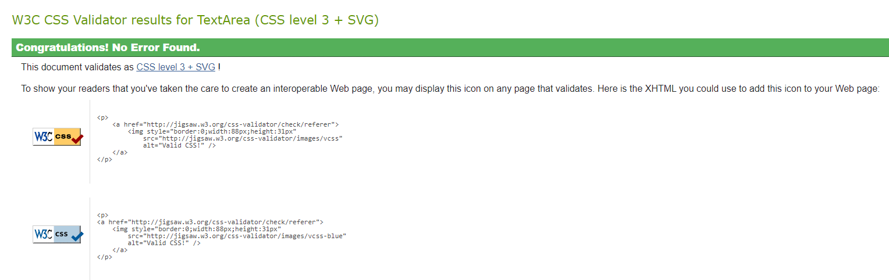

# Testing

Return back to the [README.md](README.md) file.

---
## CONTENT

- [Testing overview & environment](#testing-overview--environment)
    - [Test environment](#test-environment)
    - [Browser compatibility](#browser-compatibility)
    - [Responsiveness](#responsiveness)
- [Validator Testing](#validator-testing)
    - [HTML Validation](#html-validation)
    - [CSS Validation](#css-validation)
    - [JavaScript Validation](#javascript-validation)
---
## Testing overview & environment

### Test environment
- The website is designed to be flexible and look good on all screen sizes. To check its responsiveness, I used Chrome Development Tools by following these steps:
    - Open the Browser
    - Go to the [Wander Hub](https://wanderhub-frontend-56da935583f2.herokuapp.com/) 
    - Right-click anywhere on the page and select "Inspect" to open the Developer Tools.
    - Click on the dropdown menu labelled "Dimensions: Responsive" and select "Responsive." 
    - Resize the screen by dragging its edges, verifying that the website appears visually appealing and functional from 320px and up.

- The following devices were used to check responsiveness:
    - OnePlus 9R
    - Apple iPhone 13
    - Samsung A32 5G
    - Samsung Galaxy F22

- **Expected Results:** 
    - Each page should be responsive and user-friendly on both small and large screens.
    - No design or accessibility issues should be present across all screen sizes starting from 320px.

- **Actual Results:**
    - The website is responsive, with no scroll bars visible.
    - Content is easily accessible, and images do not appear stretched.
    - The website is user-friendly across all screen sizes.

### Browser compatibility
The application was tested on the following browsers to ensure consistent performance:
- Google Chrome
- Firefox
- Microsoft Edge

### Responsiveness
The website  is fully responsive on breakpoints supported by [React Bootstrap](https://react-bootstrap-v4.netlify.app/layout/grid/#col-props). 
The following breakpoints were considered during testing:
| **Breakpoint**    | **Prefix** | **Minimum Width** |
| ----------------- | ---------- | ----------------- |
| Extra Small       | `xs`       | `< 576px`         |
| Small             | `sm`       | `≥ 576px`         |
| Medium            | `md`       | `≥ 768px`         |
| Large             | `lg`       | `≥ 992px`         |
| Extra Large       | `xl`       | `≥ 1200px`        |
| Extra Extra Large | `xxl`      | `≥ 1400px`        |

*<span style="color: blue;">[Back to Content](#content)</span>*

## Validator Testing

### HTML Validation

- I validated HTML pages using the [W3 Nu HTML Checker]( https://validator.w3.org/nu/). 
- They came back with no errors, only pointers about redundant trailing slashes left by React.

[Posts Page]( https://validator.w3.org/nu/?doc=https%3A%2F%2Fwanderhub-frontend-56da935583f2.herokuapp.com%2F)

[Post Page]( https://validator.w3.org/nu/?doc=https%3A%2F%2Fwanderhub-frontend-56da935583f2.herokuapp.com%2Fposts%2F16)

[Profile]( https://validator.w3.org/nu/?doc=https%3A%2F%2Fwanderhub-frontend-56da935583f2.herokuapp.com%2Fprofiles%2F3)

[Edit profile]( https://validator.w3.org/nu/?doc=https%3A%2F%2Fwanderhub-frontend-56da935583f2.herokuapp.com%2Fprofiles%2F1%2Fedit)

[Sign Up]( https://validator.w3.org/nu/?doc=https%3A%2F%2Fwanderhub-frontend-56da935583f2.herokuapp.com%2Fsignup)

[Sign In]( https://validator.w3.org/nu/?doc=https%3A%2F%2Fwanderhub-frontend-56da935583f2.herokuapp.com%2Fsignin)

[PostCreateForm]( https://validator.w3.org/nu/?doc=https%3A%2F%2Fwanderhub-frontend-56da935583f2.herokuapp.com%2Fposts%2Fcreate)

[PostEditForm]( https://validator.w3.org/nu/?doc=https%3A%2F%2Fwanderhub-frontend-56da935583f2.herokuapp.com%2Fposts%2F10%2Fedit)

[Feed Page](https://validator.w3.org/nu/?doc=https%3A%2F%2Fwanderhub-frontend-56da935583f2.herokuapp.com%2Ffeed)

[Liked Page](https://validator.w3.org/nu/?doc=https%3A%2F%2Fwanderhub-frontend-56da935583f2.herokuapp.com%2Fliked)

[Saved Posts](https://validator.w3.org/nu/?doc=https%3A%2F%2Fwanderhub-frontend-56da935583f2.herokuapp.com%2Fsavedposts)

*<span style="color: blue;">[Back to Content](#content)</span>*

### CSS Validation
- All CSS files in this project have been successfully validated using the official [W3C Jigsaw CSS]( https://jigsaw.w3.org/css-validator/).
- No errors were found during the validation process, ensuring that the CSS code is error-free and follows the official CSS standards.



*<span style="color: blue;">[Back to Content](#content)</span>*

### JavaScript Validation

- This project uses ESLint to keep JavaScript code consistent and well-written. ESLint finds mistakes and checks that the code follows set rules, making it easier to read and less likely to have problems.

- ESLint is automatically integrated into the project via Create React App. The configuration is defined in `package.json`:
    ```python
    "eslintConfig": {
    "extends": [
        "react-app",
        "react-app/jest"
    ]
    }
    ```
    - `react-app`: Provides default ESLint rules for React apps.
    - `react-app/jest`: Includes additional rules for testing with Jest.
- As code is written in the editor (like Gitpod), ESLint shows errors and warnings directly in the code, helping to fix issues immediately.
- When `npm start` is run, ESLint checks the code again and prevents the app from building if there are any critical errors.
- Throughout the development of Wander Hub, ESLint has been very helpful in finding and fixing code issues. This has kept the codebase clean and in line with good JavaScript practices. When the code compiles without problems, it runs on the development server smoothly, without errors or warnings.

*<span style="color: blue;">[Back to Content](#content)</span>*