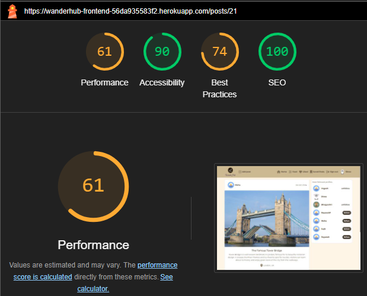
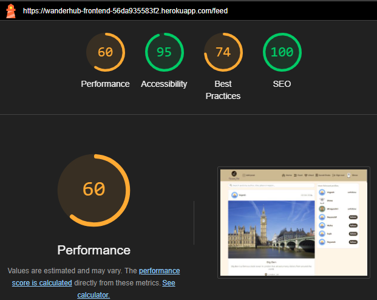

# Testing

Return back to the [README.md](README.md) file.

---
## CONTENT

- [Testing overview & environment](#testing-overview--environment)
    - [Test environment](#test-environment)
    - [Browser compatibility](#browser-compatibility)
    - [Responsiveness](#responsiveness)
    - [Accessibility Features](#accessibility-features)
- [Validator Testing](#validator-testing)
    - [HTML Validation](#html-validation)
    - [CSS Validation](#css-validation)
    - [JavaScript Validation](#javascript-validation)
- [Lighthouse](#lighthouse)
- [Manual test](#manual-test)
    - [Application Functionality Testing](#application-functionality-testing)
    - [Error Handling Testing](#error-handling-testing )
- [Automated Testing](#automated-testing)
- [Bug Overview](#bug-overview)
    - [Solved Bugs](#solved-bugs)
---
## Testing overview & environment

### Test environment
- The website is designed to be flexible and look good on all screen sizes. To check its responsiveness, I used Chrome Development Tools by following these steps:
    - Open the Browser
    - Go to the [Wander Hub](https://wanderhub-frontend-56da935583f2.herokuapp.com/) 
    - Right-click anywhere on the page and select "Inspect" to open the Developer Tools.
    - Click on the dropdown menu labelled "Dimensions: Responsive" and select "Responsive." 
    - Resize the screen by dragging its edges, verifying that the website appears visually appealing and functional from 320px and up.

- The following devices were used to check responsiveness:
    - OnePlus 9R
    - Apple iPhone 13
    - Samsung A32 5G
    - Samsung Galaxy F22

- **Expected Results:** 
    - Each page should be responsive and user-friendly on both small and large screens.
    - No design or accessibility issues should be present across all screen sizes starting from 320px.

- **Actual Results:**
    - The website is responsive, with no scroll bars visible.
    - Content is easily accessible, and images do not appear stretched.
    - The website is user-friendly across all screen sizes.

### Browser compatibility
The application was tested on the following browsers to ensure consistent performance:
- Google Chrome
- Firefox
- Microsoft Edge

### Responsiveness
The website  is fully responsive on breakpoints supported by [React Bootstrap](https://react-bootstrap-v4.netlify.app/layout/grid/#col-props). 
The following breakpoints were considered during testing:
| **Breakpoint**    | **Prefix** | **Minimum Width** |
| ----------------- | ---------- | ----------------- |
| Extra Small       | `xs`       | `< 576px`         |
| Small             | `sm`       | `≥ 576px`         |
| Medium            | `md`       | `≥ 768px`         |
| Large             | `lg`       | `≥ 992px`         |
| Extra Large       | `xl`       | `≥ 1200px`        |
| Extra Extra Large | `xxl`      | `≥ 1400px`        |

### Accessibility Features
This React project prioritizes accessibility by utilizing semantic HTML, ensuring sufficient color contrast, and providing keyboard navigation for all interactive elements. 

The application complies with Web Content Accessibility Guidelines (WCAG), with no critical errors detected by the [WAVE accessibility tool](https://wave.webaim.org/).


*<span style="color: blue;">[Back to Content](#content)</span>*

## Validator Testing

### HTML Validation

- I validated HTML pages using the [W3 Nu HTML Checker]( https://validator.w3.org/nu/). 
- They came back with no errors, only pointers about redundant trailing slashes left by React.

[Posts Page]( https://validator.w3.org/nu/?doc=https%3A%2F%2Fwanderhub-frontend-56da935583f2.herokuapp.com%2F)

[Post Page]( https://validator.w3.org/nu/?doc=https%3A%2F%2Fwanderhub-frontend-56da935583f2.herokuapp.com%2Fposts%2F16)

[Profile]( https://validator.w3.org/nu/?doc=https%3A%2F%2Fwanderhub-frontend-56da935583f2.herokuapp.com%2Fprofiles%2F3)

[Edit profile]( https://validator.w3.org/nu/?doc=https%3A%2F%2Fwanderhub-frontend-56da935583f2.herokuapp.com%2Fprofiles%2F1%2Fedit)

[Sign Up]( https://validator.w3.org/nu/?doc=https%3A%2F%2Fwanderhub-frontend-56da935583f2.herokuapp.com%2Fsignup)

[Sign In]( https://validator.w3.org/nu/?doc=https%3A%2F%2Fwanderhub-frontend-56da935583f2.herokuapp.com%2Fsignin)

[PostCreateForm]( https://validator.w3.org/nu/?doc=https%3A%2F%2Fwanderhub-frontend-56da935583f2.herokuapp.com%2Fposts%2Fcreate)

[PostEditForm]( https://validator.w3.org/nu/?doc=https%3A%2F%2Fwanderhub-frontend-56da935583f2.herokuapp.com%2Fposts%2F10%2Fedit)

[Feed Page](https://validator.w3.org/nu/?doc=https%3A%2F%2Fwanderhub-frontend-56da935583f2.herokuapp.com%2Ffeed)

[Liked Page](https://validator.w3.org/nu/?doc=https%3A%2F%2Fwanderhub-frontend-56da935583f2.herokuapp.com%2Fliked)

[Saved Posts](https://validator.w3.org/nu/?doc=https%3A%2F%2Fwanderhub-frontend-56da935583f2.herokuapp.com%2Fsavedposts)

*<span style="color: blue;">[Back to Content](#content)</span>*

### CSS Validation
- All CSS files in this project have been successfully validated using the official [W3C Jigsaw CSS]( https://jigsaw.w3.org/css-validator/).
- No errors were found during the validation process, ensuring that the CSS code is error-free and follows the official CSS standards.


*<span style="color: blue;">[Back to Content](#content)</span>*

### JavaScript Validation

- This project uses ESLint to keep JavaScript code consistent and well-written. ESLint finds mistakes and checks that the code follows set rules, making it easier to read and less likely to have problems.

- ESLint is automatically integrated into the project via Create React App. The configuration is defined in `package.json`:
    ```python
    "eslintConfig": {
    "extends": [
        "react-app",
        "react-app/jest"
    ]
    }
    ```
    - `react-app`: Provides default ESLint rules for React apps.
    - `react-app/jest`: Includes additional rules for testing with Jest.
- As code is written in the editor (like Gitpod), ESLint shows errors and warnings directly in the code, helping to fix issues immediately.
- When `npm start` is run, ESLint checks the code again and prevents the app from building if there are any critical errors.
- Throughout the development of Wander Hub, ESLint has been very helpful in finding and fixing code issues. This has kept the codebase clean and in line with good JavaScript practices. When the code compiles without problems, it runs on the development server smoothly, without errors or warnings.

*<span style="color: blue;">[Back to Content](#content)</span>*

## Lighthouse

### Home Page
<details>
  <summary>Home Page - Desktop</summary>
    

</details>

<details>
  <summary>Home Page - Mobile</summary>
    

</details>

### Sign In Page
<details>
  <summary>Sign In Page - Desktop</summary>
    

</details>

<details>
  <summary>Sign In Page - Mobile</summary>
    

</details>

### Sign Up Page
<details>
  <summary>Sign Up Page - Desktop</summary>
    

</details>

<details>
  <summary>Sign Up Page - Mobile</summary>
    

</details>

### Posts Detail View
<details>
  <summary>Posts Detail View - Desktop</summary>
    

</details>

<details>
  <summary>Posts Detail View - Mobile</summary>
    

</details>

### Profile Page
<details>
  <summary>Profile Page - Desktop</summary>
    

</details>

<details>
  <summary>Profile Page - Mobile</summary>
    

</details>

### Feed Page
<details>
  <summary>Feed Page - Desktop</summary>
    

</details>

<details>
  <summary>Feed Page - Mobile</summary>
    

</details>

### Saved Page
<details>
  <summary>Saved Page - Desktop</summary>
    

</details>

<details>
  <summary>Saved Page - Mobile</summary>
    

</details>

### Liked Page
<details>
  <summary>Liked Page - Desktop</summary>
    

</details>

<details>
  <summary>Liked Page - Mobile</summary>
    

</details>

*<span style="color: blue;">[Back to Content](#content)</span>*

## Manual Test

### Application Functionality Testing

| Page | Feature/Link/Button	| Action	| Expected Result	| Actual Result |
|---|---|---|---|---|
|All Pages|Favicon|Open the website|The favicon appears in the browser tab|Favicon displayed correctly|
|All Pages|Navigation Menu|Click on links in the navigation menu|User is taken to the corresponding page without a refresh|Navigation works as expected|
|Navigation Bar|Sign Up Link|Click the Sign Up link|User is directed to the Sign Up form|Redirected correctly|
|Sign Up Page|Form Submission|Fill in form and submit|User is successfully signed up|Signup successful|
|Navigation Bar|Sign In Link|Click the Sign In link|User is directed to the Sign In form|Redirected correctly|
|Sign In Page|Form Submission|Enter credentials and submit|User is logged in and taken to the home page|Signin successful|
|Navigation Bar|Sign Out Link|Click the Sign Out link|User is logged out and redirected to the home page|Sign out works|
|Home Page|View Posts|Scroll down the page|List of all recent posts is displayed with the latest on top|Posts displayed correctly|
|Home Page|Infinite Scrolling|Scroll down the page|More posts are loaded seamlessly|Infinite scrolling works|
|Home Page|Search Bar|Enter a keyword and press search|List of posts matching the keyword is displayed|Search results correct|
|Home Page|Click on Post|Click a post to view details|User is taken to the Post Detail View|Redirected correctly|
|Post Detail Page|Like Post Icon|Click the like icon|Like count increases, icon changes to solid|Like functionality works|
|Post Detail Page|Save Post Icon|Click the save icon|Post is saved, icon changes to solid|Save functionality works|
|Liked Posts Page|View Liked Posts|Click on Liked Posts link in the navigation menu|Displays all posts the user has liked|Liked posts displayed|
|Saved Posts Page|View Saved Posts|Click on Saved Posts link in the navigation menu|Displays all posts the user has saved|Saved posts displayed|
|Profile|View Profile|	Click on a user's profile|Redirected to the user's profile page displaying their information and posts|Successfully redirected to user profile page with details shown|
|User Profile Page|View User Profile|Click on the user's profile link|Displays the user's profile with avatar, posts, and details|User profile displayed|
|User Profile Page|View User Posts|Click on a user's profile avatar|Displays all posts from that user|User posts displayed|
|User Profile Page|Avatar Image|View the user's avatar|The user's avatar is displayed correctly|Avatar displayed correctly|
|User Profile Page|Follow User|Click the follow button|User starts following the selected user|Follow functionality works|
|User Profile Page|Unfollow User|Click the unfollow button|User is no longer following that profile|Unfollow works|
|Profile|Edit Profile|Click on the edit option|Redirected to the profile edit form with pre-filled information|Successfully redirected to edit profile form with pre-filled data|
|Profile|Change Username|Click on the change username option|Redirected to username change form. Username is successfully changed and updated across the platform|Username successfully changed and updated across the platform|
|Profile|Change Password|Click on the change password option|Redirected to password change form. Password is updated after validation|Password changed successfully with validation checks|
|Feed Page|View Feed|Click on the Feed link in the navigation menu|Displays a feed of posts from users the logged-in user follows|Feed displayed correctly|
|Feed Page|Scroll Through Feed|Scroll down the feed|More posts load seamlessly as the user scrolls|Infinite scrolling works|
|Feed Page|Like Post in Feed|Click the like icon on a post in the feed|Like count increases for the specific post|Like functionality works|
|Feed Page|Comment on Post|Click on the comment icon on a post|Comment section expands for user to enter a comment|Comment section opens|
|Feed Page|Save Post in Feed|Click the save icon on a post in the feed|Post is saved, icon changes to solid|Save functionality works|
|Most Followed Profiles|Popular Profiles Sidebar|View the list of most-followed profiles|The sidebar displays profiles sorted by the number of followers. Profiles are clickable to view detailed info|Sidebar correctly displays popular profiles sorted by follower count. Clicking a profile opens its page|
|Most Followed Profiles|Follow Button|Click follow on a profile from the sidebar|The user follows the selected profile, and the follower count updates instantly|User followed, follower count updated instantly|
|Most Followed Profiles|Unfollow Button|Click unfollow on a profile from the sidebar|The user unfollows the profile, and the follower count updates instantly|User unfollowed, follower count updated instantly|
|Feed Page|Follow Button|Click follow on a user's profile|User is followed, and their posts appear in the user's feed|User followed, posts appeared in the feed immediately|
|Feed Page|Unfollow Button|Click unfollow on a user's profile|User is unfollowed, and their posts are removed from the user's feed|User unfollowed, posts removed from the feed immediately|
|All Pages|Default Post Image|Create a post without an image|A default post image is displayed instead|Default image shown|
|All Pages|Default Profile Image|View a user profile without an avatar|A default profile image is displayed instead|Default avatar shown|
|Add Post|Add Post Icon|Click on the Add Post icon|Redirected to the Add Post creation form|Successfully redirected to the Add Post creation form|
|Add Post|Post Creation Form|Fill in Title, Image, Content, Place, Region|Successfully creates a post and displays it on Home page and in the user’s feed|Post created and displayed on Home page and in the feed|
|Add Post|Image Upload|Upload an image|Image uploads successfully; default image used if none is uploaded|Image uploaded successfully. Default image displayed when no image uploaded|
|Edit or Delete Post|Edit Icon|Click the edit icon on a post|Redirected to the edit form with pre-populated fields|Successfully redirected to the edit form with pre-filled data|
|Edit or Delete Post|Delete Icon|Click the delete icon on a post|Post is deleted; user is redirected to the previous page|Post deleted, returned to previous page|
|Comment|Add Comment Form|Fill in the comment and post|Comment appears below the post, and comment count increases|Comment added and count updated|
|View Comment|Comments Icon|Click on comments icon|Redirected to post detail page displaying all comments|Successfully redirected to post detail page with comments displayed|
|Edit or Delete Comment|Edit Icon|Click the edit icon next to a comment|Redirected to edit form with pre-filled comment text|Successfully redirected to edit form with pre-filled comment|
|Edit or Delete Comment|Delete Icon|Click the delete icon next to a comment|Comment is deleted, and user is returned to the previous page|Comment deleted, returned to previous page|
|Comment Reaction|Thumbs-Up Icon|Click on the thumbs-up icon|Reaction is recorded, icon turns solid red, and reaction count increases|Reaction recorded, icon updated to solid red, count increased|

*<span style="color: blue;">[Back to Content](#content)</span>*

### Error Handling 

| Feature	| Action	| Expected Result	| Actual Result |
|---|---|---|---|
|Sign Up|Submit form with missing or invalid data|User is shown an error message:"This field may not be blank."|Error message displayed as expected|
|Sign Up|Submit form with an existing username|User is shown an error message: "A user with that username already exists."|Error message displayed as expected|
|Sign In|Enter incorrect username or password|User is shown an error message: "Unable to log in with provided credentials."|Error message displayed as expected|
|Sign In|Submit form with missing credentials|User is shown an error message: "This field may not be blank"|Error message displayed as expected|
|Like Post|Click "like" button without being logged in|Tooltip prompts user to log in to perform the action|Tooltip displayed correctly|
|Save Post|Click "save" button without being logged in|Tooltip prompts user to log in to perform the action|Tooltip displayed correctly|
|Add Post|-Submit post form with missing data|User is shown an error message indicating missing fields|Error message displayed as expected|
|Add Post|Upload an unsupported file format for post image|Error message is displayed:"Upload a valid image. The file you uploaded was either not an image or a corrupted image."|Error message displayed as expected|
|Edit Post|	Leave required fields blank|Error message displayed: "This field may not be blank."|Error message displayed, edit not saved|
|Search Functionality|Enter invalid characters in the search bar|Error message or no results message shown|No results Found message displayed as expected|
|Profile Update|Try to upload an unsupported avatar image|Error message displayed: "Upload a valid image. The file you uploaded was either not an image or a corrupted image."|Error message displayed as expected|
|Change Username|Submit empty username field|Error message displayed: "This field may not be blank."|Error message displayed as expected|
|Reset Password|Submit without filling in required fields|Error message displayed: "This field may not be blank."|Error message displayed as expected|
|404 Page Not Found|Access an invalid or non-existing URL|User is redirected to a custom 404 error page|404 page displayed correctly|
|Like Own Post|Try to like their own post|User is prevented from liking their own post, and a tooltip appears stating this action is not allowed|Tooltip displayed: "You cannot like your own post|
|Save Own Post|Try to save their own post|User is prevented from saving their own post, and a tooltip appears stating this action is not allowed|Tooltip displayed: "You cannot save your own post"|
|Comment on Own Post|Try to comment on their own post|User is prevented from commenting on their own post, and a tooltip appears stating this action is not allowed|Tooltip displayed: "You cannot comment on your own post"|
|React to Own Comment|Try to react to their own comment|User is prevented from reacting to their own comment, and a tooltip appears stating this action is not allowed|Tooltip displayed: "You cannot react to your own comment|

*<span style="color: blue;">[Back to Content](#content)</span>*

## Automated Testing

### Unit Testing

- Automated testing has only been done for the navbar component. For the tests, I used the CI Moments Walkthrough as a reference.
- This project uses Jest and React Testing Library for unit testing components. The tests are located in the `__tests__` folder within the `src/components` directory.
- The `NavBar.test.js` file contains several tests for the `NavBar` component. The first test checks that the "Sign in" link is present in the navigation bar. The second test ensures that the profile avatar appears for a logged-in user. Finally, the third test verifies that the "Sign in" and "Sign up" links reappear after a user logs out.
- To run the tests, use the command `npm test` in the terminal. This will execute all tests in the project and display the results.
- Link to test files can be found here: [NavBar](https://github.com/bhagyashriyogeshpatil/wanderhub-frontend/blob/main/src/components/__tests__/NavBar.test.js)


*<span style="color: blue;">[Back to Content](#content)</span>*

## Bug Overview

### Solved Bugs

- **1.** Uncaught Runtime Error in SignUpForm Component 

  - **Issue:** When using the SignUpForm component in the frontend, a runtime error occurred:
  ```javascript
  Cannot read properties of undefined (reading 'username') 
  TypeError: Cannot read properties of undefined (reading 'username')
  ```
  - This error happens because the `username` property of the `errors` state is being accessed when it is undefined.  

  - **Fix:** I updated the CORS configuration in the API's `settings.py` file. The new code is:
  ```python 
  if 'CLIENT_ORIGIN_DEV' in os.environ:
      CORS_ALLOWED_ORIGIN_REGEXES = [r"^https://.*\.codeinstitute-ide\.net$",]
  ```
  - This change allows the frontend to connect properly with the backend, fixing the error in the SignUpForm component.


- **2.** Image Upload Issue in PostCreateForm Component
  - **Issue:** There was a problem with how images were being added to the form in the `PostCreateForm` component. The previous code used this line: 

    ```javascript
    formData.append("image", imageInput.current.files[0]);
    ```
    This could cause errors if no image was selected, as it would try to submit an undefined value.
  - **Fix:** The code was updated to check if an image file is selected before adding it to the form data. The new code looks like this:
    ```javascript
    if (imageInput.current.files[0]) { 
    formData.append("image", imageInput.current.files[0]);
    }
    ```

- **3.** Jest Failing to Parse axios Due to ES Module Syntax
  - **Issue:** While running tests using Jest, I have encounter the following error:
    ```javscript
    SyntaxError: Cannot use import statement outside a module
    ```
    This error occurs because axios uses ES module syntax (import) by default, but Jest expects CommonJS (require) modules.
  - **Fix:** Use CommonJS Version of axios -  To fix this issue, update the package.json file with the following Jest configuration:
    ```json
    "jest": { 
    "moduleNameMapper": { 
    "^axios$": "axios/dist/node/axios.cjs" 
    }
    }
    ```
    This tells Jest to use the CommonJS version of axios, which resolves the issue.
    [Refer Stackoverflow](https://stackoverflow.com/questions/75523632/cannot-use-import-statement-outside-a-module-with-axios-in-react/76458512#76458512)

- **4.** NavBar Test Fails Due to Timing Issues After Logout
  - **Issue:** The test that checks if the "Sign in" and "Sign up" buttons show up again after logging out sometimes fails because of timing issues. The `findByRole` method waits for the buttons to appear, but it might not wait long enough if the UI takes time to update after logging out. This can cause the test to pass or fail randomly.
  - **Fix:** To fix this, the `waitFor` method is used to wait until the "Sign in" and "Sign up" buttons are visible after clicking "Sign out." This ensures the test waits properly for the UI to update.

- **5.** Deprecation Warning: `ReactDOMTestUtils.act` in Tests After Update
  - **Issue:** 
    - After updating the code, the following warning appears during testing:
  `Warning: ReactDOMTestUtils.act is deprecated in favor of React.act. Import act from react instead of react-dom/test-utils.`
    - This happens when running tests in `NavBar.test.js`, even though all tests pass. The issue seems related to how `fireEvent` triggers DOM updates.
  - **Fix:** 
    - I reviewed the imports to ensure that `act` is imported from React instead of `react-dom/test-utils`. I updated the import statement to:
        ```javascript
        import { act } from 'react';
        ```
    - I wrapped events in `act()` to properly handle state updates. I used `act()` to wrap `fireEvent.click()` when simulating user actions:
        ```javascript
        act(() => {
        fireEvent.click(signOutLink);
        });
        ```

- **6.** Deprecated findDOMNode Warning in Development
  - **Issue:** Using `React.StrictMode` in the application caused a deprecated `findDOMNode` error during development.
  - **Fix:** Removed `React.StrictMode` from `index.js` to eliminate the error and improve the development experience.

- **7.** Invalid DOM Property Warning
  - **Issue:** 
    - When running the application, I encounter the following warning in the console:
  ``` Warning: Invalid DOM property `class`. Did you mean `className`? ```
    - This happens because React uses `className` instead of `class` to assign CSS classes to elements.
  - **Fix:** To resolve this issue, I reviewed the components for any use of the `class` attribute and update it to `className`.

- **8.** Dependency Conflict When Installing jwt-decode
  - **Issue:** 
    - When trying to install jwt-decode@3.1.2, I encountered an error due to a conflict with @testing-library/react. The project was using React version 17.0.2, which was incompatible with @testing-library/react@13.4.0.
    ```bash
    npm error code ERESOLVE
    npm error ERESOLVE could not resolve
    ...
    Could not resolve dependency:
    npm error peer react@"^18.0.0" from @testing-library/react@13.4.0
    ```
  - **Fix:**
    - To resolve this issue, I downgraded @testing-library/react to a compatible version
    ```bash
    npm install @testing-library/react@^11.2.7
    ```
    - Then, I successfully installed jwt-decode:
    ```bash
    npm install jwt-decode@3.1.2
    ```
    - Downgrading @testing-library/react resolved the conflict, allowing the installation of jwt-decode.

- **9.** Bio Field Not Displaying on Profile Page
  - **Issue:** The `bio` field was not showing on the Profile Page after editing the profile. API response returned an empty `bio` field after form submission.
  - **Fix:** Renamed the `content` field to `bio` in the ProfileEditForm component. Ensured the correct `bio` field is submitted to the API during form submission. Tested and confirmed the `bio` is now updating and displaying properly.

- **10.** TypeError: (0 , _react2.act) is not a function
  - **Issue:** When running tests for the `NavBar` component, you may encounter a `TypeError` indicating that `(0 , _react2.act)` is not a function. This error occurs due to an incorrect import of the `act` function.
  - **Fix:** 
    - To resolve this issue, in `src/components/__tests__/NavBar.test.js` file, locate the import statement for `act` and change it from `import { act } from 'react';` to` import { act } from '@testing-library/react';`. 
    - After making this change, save the file and run the tests again using the command npm test. This should fix the issue and the tests to pass.

*<span style="color: blue;">[Back to Content](#content)</span>*